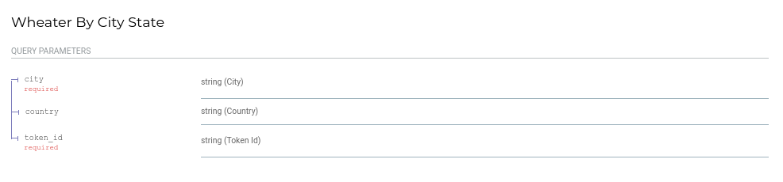

  &nbsp;&nbsp;&nbsp;&nbsp;&nbsp;
  &nbsp;&nbsp;&nbsp;&nbsp;
  

  

# WeatherAPI v1.0

## **Technologies**

    - PYTHON
    - FASTAPI

  

## **Get Started**

To run this app I crated a service shell script that provide you all the tools
you need to: Run, Deploy and Test. You have to follow some easy steps:

#### **Clone the respository in your local machine**

#### **Allow to the service authorization to run**

Open your linux terminal. Once you are in the root of the project. Run linux the following command:

`chmod -wx service.sh`

#### **Run the service**

Now you have to run: `./service.sh`

  

## **Diagrams**

### Flow Diagrama

  

## **Response and Request examples**

Request Weather endpoint

`/api/v1/weather/?city=[city]&token_id=[token_id]`

Response from Weather endpoint

## **Basic Auth API**

This version of the app has not so robust authentication layer. To use this app you have to use
add in the request this api token. 

**API token:** 3b719353762f7ddfc080e13556d248e8d8af1a63590b6d17738e4f57ac18a5d1

  

## **Project specifications**
